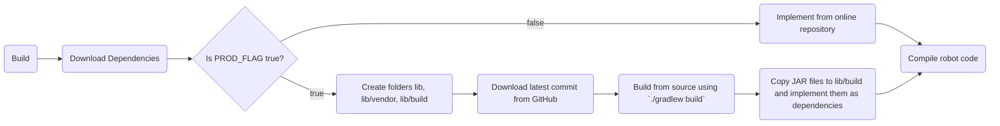

# Build from Source vs. from Online Library

## Purpose

When you're in a situation where you don't have time to re-publish a library, you can enable a flag that builds the robot code from the latest commit or local version of the library rather than the online repository. This allows you to modify the library's code **locally** without needing to push it to GitHub. This process is streamlined by using [JitPack](https://jitpack.io) for building the library. **Note**: Do not use this process without JitPack.

## Methodology

1. The `.env` file includes a `PROD_FLAG` that can be set to either `"true"` or `"false"`. The default value is `"false"`.
2. The `gradlew.bat` script will:
    - Build the library from the latest published version if the `PROD_FLAG` is `"false"`.
    - Build the library from the source code (latest commit or local changes) if the `PROD_FLAG` is `"true"`.



### `PROD_FLAG` Behavior:
- **PROD_FLAG = "false"**: The script pulls the dependency from the **online repository** using JitPack or specified default implementation string.
- **PROD_FLAG = "true"**: The script clones the repository from GitHub and builds the dependency from the **latest commit or local changes**.

## Usage

In your `build.gradle` file, you can manage dependencies based on the `PROD_FLAG` environment variable:

### Example Code:
```java
dependencies {

    // Add other dependencies here
    
    // Use addGithubRepo for dynamic GitHub dependencies
    addGithubRepoJitPack("__USER__", "__REPO__", "__VERSION__")
    // Example: addGithubRepoJitPack("lolhol", "KeybindConfigurator", "0.2")

    // For testing
    testImplementation 'org.junit.jupiter:junit-jupiter:5.10.1'
    testRuntimeOnly 'org.junit.platform:junit-platform-launcher'
}
```

## How It Works:

- If you are in **non-production mode** (`PROD_FLAG = "false"`):
    - The script pulls the dependency from JitPack using the format: `com.github.__user__:__repo__:__version__`.

- If you are in **production mode** (`PROD_FLAG = "true"`):
    - The script clones the GitHub repository, builds the project, and automatically adds the built `.jar` files as dependencies in the project.

### Steps in Production Mode:

1. Clone the GitHub repository locally.
2. Build the project using Gradle's `./gradlew build` command.
3. Copy the resulting `.jar` files to the `lib/build` directory.
4. Add the `.jar` files as dependencies to the project.